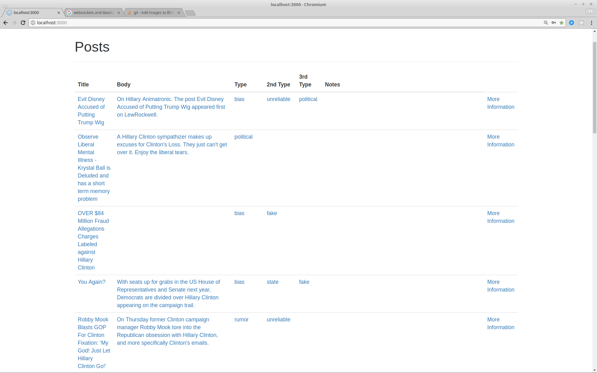
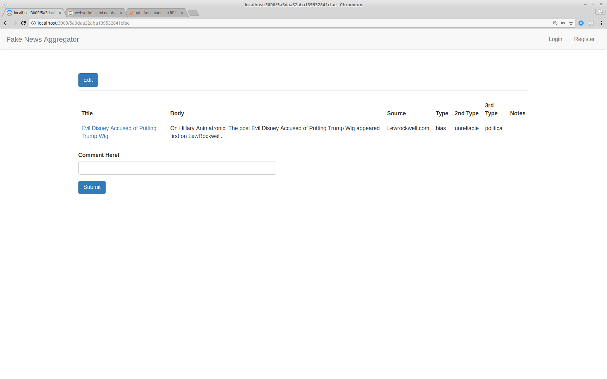

# nov-hackaton-studious-chainsaw

HACKATON NOV 2017

Welcome to Fake News Aggregator app that lets you check the validity of breaking news.

This app is basically Google News with fake news tags. Each breaking news article has tags determining its validity. Also, users are able to comment/vote on the validity of each breaking news.

DO NOT USE NODEMON for this app.

Getting Started

Fork and clone this repo
cd into the project directory
Go to https://newsapi.org/ and get API key, put this in a .env file in a main directory like so:
NEWS_API_KEY={YOUR API KEY HERE}

RUN npm i
RUN node app.js
THEN go into localhost, sign up, and login
Click on a link's more information to get more information about the link

Things left to do:
1.Comments should show content in addition to the username
2.Voting for each news article
3.Stop database from seeding every time the app is accessed
